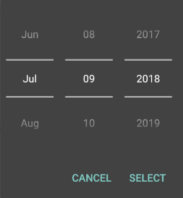
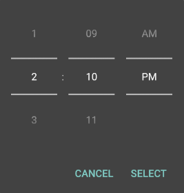
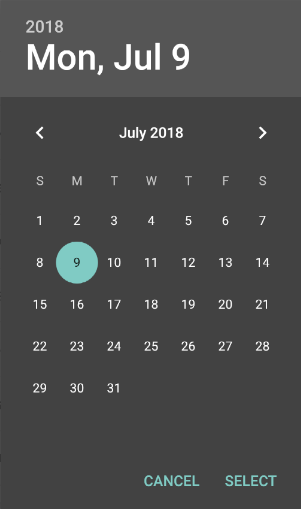
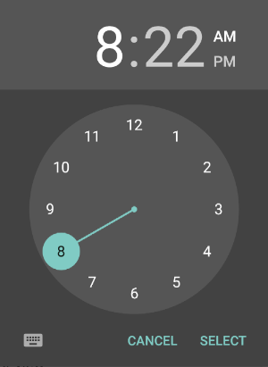

# Android date/time picker styling with Cordova

When Lollipop came out, the default styling changed for date and time pickers. A common question on the Internet is, how do I change the date and time picker dialog style back to a 'spinner'.  While this write-up is primarily in context of use of my [plugin](../README.md) in combination with Cordova, the same technique can be applied for other projects/frameworks.

## Some history

A few years back when I first researched this and attempted to build support for it into the plugin, I went with a kindof hack: using reflection. By setting the `android.calendar` property to false, internally some magic was done.

The problem however is that it is not even guaranteed to work. Firstly, reflection can break with newer API levels, but more importantly, not every theme is supported. And this is what causes confusion, it just isn't very reliable - on some devices it works, on others it does not.

So let's do it the proper way!

> For this tutorial I am assuming you are using Cordova 8, but it should be similar for other configurations and versions.

## Creating a custom theme and styles

- From the Cordova project root, navigate to the `./res` folder.
- In this folder create a `styles.xml` file.
- As an example let's use this XML and paste it in the `./res/styles.xml` file:

  ```xml
  <?xml version='1.0' encoding='utf-8'?>
  <resources>
    <!-- Declare a new custom main theme. -->
    <style name="MyAppTheme" parent="android:Theme.DeviceDefault.NoActionBar">
      <!-- Reference custom styles that should be active for this theme. -->
      <item name="android:datePickerStyle">@style/MyDatePickerStyle</item>
      <item name="android:timePickerStyle">@style/MyTimePickerStyle</item>
    </style>

    <!-- Custom date picker styles. -->
    <style name="MyDatePickerStyle" parent="android:Widget.Material.DatePicker">
      <item name="android:datePickerMode">spinner</item>
    </style>

    <!-- Custom time picker styles. -->
    <style name="MyTimePickerStyle" parent="android:Widget.Material.TimePicker">
      <item name="android:timePickerMode">spinner</item>
    </style>
  </resources>
  ```

In this example theme:

- we defined a theme named `MyAppTheme` which we will apply to the Android activity later on.
- we defined two custom styles for the date and time picker widget, with an attribute `datePickerMode` and `timePickerMode` both set to `spinner`. This should change the pickers from radials into spinners.

## Applying the theme

- Open the `config.xml` in the Cordova project root.
- Add the Android schema with a namespace declaration to the `widget` element if it isn't already there:

  ```xml
  <widget ... xmlns:android="http://schemas.android.com/apk/res/android">
  ```

- Add the following XML to the `widget` element:

  ```xml
  <widget ...>
    ...
    <platform name="android">
      <resource-file src="res/styles.xml" target="app/src/main/res/values/styles.xml" />
      <edit-config file="AndroidManifest.xml" mode="merge" target="/manifest/application/activity">
        <activity android:theme="@style/MyAppTheme" />
      </edit-config>
    </platform>
    ...
  </widget>
  ```

Let's break down what is happening:

### Platform specific configuration

The `platform` element allows us configure the Android platform specifically, as this does not apply to `iOS` or others.

```xml
<platform name="android">
</platform>
```

### Copy the styles file

With the `resource-file` element we can copy a file to a target folder during build.

```xml
<resource-file src="res/styles.xml" target="app/src/main/res/values/styles.xml" />
```

> The base location of `src` is the project root, whereas the `target` location points to the location under the platform folder (`platforms/android`).
>
> NOTE: The `target` location may differ for other Cordova versions.

### Transform AndroidManifest.xml

To enable our custom theme, we replace the default theme with our own on the `activity` element:

```xml
<edit-config file="AndroidManifest.xml" mode="merge" target="/manifest/application/activity">
  <activity android:theme="@style/MyAppTheme" />
</edit-config>
```

> After building the project, the `AndroidManifest.xml` should be updated and the `styles.xml` file should be copied, even when completely rebuilding the project from scratch.

## Showing the date or time picker with the custom material theme

Now, when showing the date/time picker, make sure to specify `0` for the `android.theme` property to enable the custom theme.

```javascript
cordova.plugins.DateTimePicker.show({
  mode: "datetime",
  date: new Date(),
  android: {
    theme: 0
  },
  success: function (newDate) {
    // handle date
  }
})
```

## Build and run

- `cordova build android`
- `cordova emulate android`

You should now have both pickers in spinner mode.

 

## Mix it up

_But wait, what about the original, default radial pickers. Can I still use those too?_

Don't worry, just specify one of the built-in themes from [R.style](https://developer.android.com/reference/android/R.style.html#Theme_DeviceDefault_Dialog).

```javascript
cordova.plugins.DateTimePicker.show({
  mode: "datetime",
  date: new Date(),
  android: {
    theme: 16974126 //Theme_DeviceDefault_Dialog
  },
  success: function (newDate) {
    // handle date
  }
})
```

And the result:

 

## Conclusion

With some extra configuration it is fairly easy to get spinners back in a reliable way and with proper theming.

While in this example I solely focus on changing the picker mode style, there are more styling options available, but I will leave that as an exercise to the reader.
